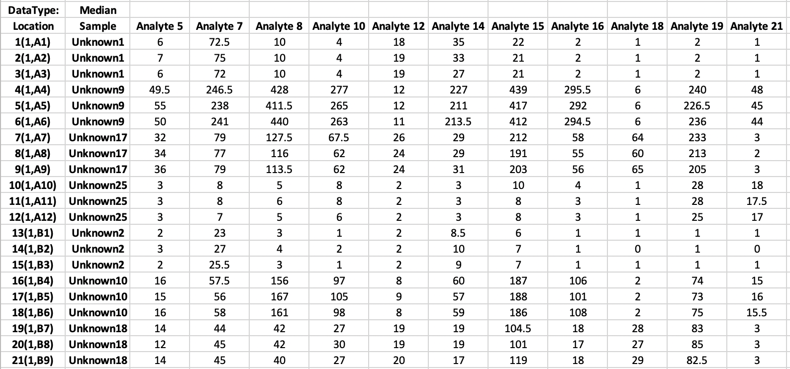

<!--
%\VignetteEngine{knitr::rmarkdown}
%\VignetteIndexEntry{Using bbeaR}
-->

```{r setup, include=FALSE}
knitr::opts_chunk$set(echo = TRUE, message = FALSE)
```

# About

The **Bead-Based Epitope Assay** *(BBEA)* can be used to quantify the amount of epitope- or peptide-specific antibodies (e.g., IgE) in plasma or serum samples. A detailed assay description is outlined in 
<a href="https://www.nature.com/articles/s41598-019-54868-7" target="_blank">this publication</a> 

In this tutorial, we will analyze a dataset of the sequential epitope-specific *(ses-) IgE* profiles in patients allergic to milk that were treated with milk oral immunotherapy (OIT) (<a href="https://pubmed.ncbi.nlm.nih.gov/30528770/" target="_blank">Suárez-Fariñas et al (2018)</a>). Subjects (7-35 years of age) with IgE-mediated cow’s milk allergy were randomized 1:1 to receive omalizumab or placebo in a double-blind, placebo-controlled trial to evaluate whether the addition
of omalizumab to milk OIT would reduce treatment-related adverse reactions and increase the frequency of patients achieving "sustained unresponsiveness" to milk. Detailed description and primary outcomes of this trail were published in <a href="https://pubmed.ncbi.nlm.nih.gov/26581915/" target="_blank">Wood et al (2015)</a>.   

The levels of 66 ses-IgE antibodies were measured using *BBEA* in plasma of 47 enrolled subjects at baseline and at 32-months of treatment with milk OIT plus placebo or omalizumab.     

We will start by installing *bbeaR* and reading in the *BBEA's* raw data (alternatively, one can load an R dataset that comes with this package). We will look at several quality control (QC) measures and normalize the data. Then we will demonstrate an approach to identify ses-IgE antibodies that is different between children treated with Placebo or Omalizumab as adjuvants for milk Oral Immunotherapy (mOIT), using <a href="https://bioconductor.org/packages/release/bioc/html/limma.html" target="_blank">limma</a> modeling framework.

# Installation

*bbeaR* is an R package and is installed using a standard github command:

```{r eval=FALSE}
library(devtools)
install_github('msuprun/bbeaR')
```

Loading additional packages that will be used in the analyses.

```{r Packages}
library(bbeaR)
library(plyr)
library(stringr)
library(ggplot2)
library(gridExtra)
library(pheatmap)
library(RColorBrewer)
library(limma)
```

# Raw Data Import
47 patients were assayed before and after treatment, for a total of 94 samples, each ran in triplicate on four 96-well plates. The runs additionally included three background wells, without any sample (aka “Buffer”, for background signal quantification).

The original *.csv* files from the Luminex-200 assay, generated with the xPONENT® software, can be downloaded <a href="https://github.com/msuprun/bbeaR/tree/master/inst/extdata" target="_blank">here</a>. The .csv sheet consists of several sections, of which "Median", "Count", and "NetMFI" hold the assay's readout values for each epitope-specific antibody (*j*) in columns and each sample (*i*) in rows: 
  
First, we need to create a plate layout using the *create.plate.db()* function. This layout will be used in the import and some of the plotting functions. The only input to this function is the direction of the plate read (horizontal or vertical). 

```{r Plate layout}
l <- create.plate.db(direction = "horizontal")
plate.design.db <- l$plate.design.db
plate.design <- l$plate.design
plate.design
```

Then read all four *.csv* files.    
Note: a separate tutorial (Egg Allergy Example) has an example of importing and processing a single plate.

```{r Raw files}
file_names <- dir(path = "./", pattern=".csv", 
                  all.files = FALSE, full.names = TRUE)
bbea <- bbea.read.csv.all(file_names[grepl("MOIT_IgE",file_names)]) 
```

The *bbea* list object contains several elements, extracted from the assay's output.

```{r}
names(bbea)
```

The **Median**, **NetMFI**, and **Count** are matrices with rows as Analytes (epitopes) and columns as Samples. Note: this is changed from the original data layout, where samples were in rows and epitopes in columns, to make the dataset usable with common analytical tools in R. 
   
The **Median** are the Median Fluorescence Intensities (MFIs) and the **NetMFI** are the Medians normalized to background. In our example, **Median** and **NetMFI** have exactly same values, since normalization was not selected during the assay run. <a href="https://www.luminexcorp.com/blog/its-all-about-the-stats/" target="_blank">This post</a> has more details about the Luminex outputs.

```{r}
bbea$Median[1:5, 1:2]
```

The **Count** are the numbers of beads counted per analyte, and is important quality control measure. 

```{r}
bbea$Count[1:5, 1:2]
```

The **AssayInfo** saves parameters of the assay.

```{r}
bbea$AssayInfo[1:15, 1:2]
```

Finally, *bbea.read.csv()* creates a **phenotype (p)Data** that has some basic information about the samples and the assay run. 

```{r}
colnames(bbea$pData)
bbea$pData[1:2, 1:2]
```

We can now add external information about the samples and analytes.   
Load already imported data that includes **p**henotype (clinical) **d**ata *PD* and an annotation file *Annot*. Note: this will also load a *bbea* list object (generated in the previous steps).  

```{r Load pheno data}
data(Milk)
```

The annotation **Annot** dataset contains the mapping of Luminex beads (Analytes) to the peptides/epitopes.

```{r}
dim(Annot)
head(Annot)
```

Changing the *bbea* object to have milk epitope names instead of Luminex analyte numbers.

```{r Adding Annotation}
bbea <- bbea.changeAnnotation(bbea.obj = bbea, 
                              annotation = Annot,
                              newNameCol = "Peptide", 
                              AnalyteCol = "Analyte")
bbea$Median[1:5, 1:2]
```

The **PD** dataset has clinical information about our samples.

```{r}
dim(PD)
head(PD)
```

We will clean up the pData and then merge it with PD. This step is not necessary, but will be useful when we do statistical modelling.   

```{r Adding information about samples}
bbea$pData$Rows <- rownames(bbea$pData)
bbea$pData <- mutate(merge(bbea$pData,PD,by=c("Location","Plate"),all.x=T),
                     Sample=mapvalues(SUBJECT.ID,NA,"Buffer"))
rownames(bbea$pData) <- bbea$pData$Rows

```

# Quality Control of the Raw Data

We want to make sure that there are no missing samples or analytes. This would be reflected by the very low counts (<25).   
The heatmap shows that all samples and analytes are were included.

```{r fig.height=6}
bbea.QC.heatmap.counts(bbea,
                       getlog2=FALSE,
                       filename="QC.CountsHeatmap.pdf",
                       plateVar="Plate", ann=NULL)
```

All counts seem to be high and we don't see any specific sample or epitope to be missing.  
However, when having multiple plates, it might be more useful to have a counts heatmap for each plate separately. This can be achieved by running *bbea.QC.heatmap.counts.byPlate()* function.

```{r eval=FALSE}
bbea.QC.heatmap.counts.byPlate(bbea, getlog2=FALSE,
                               filename="QC.CountsHeatmap",
                               plateVar="Plate", ann=NULL, he=7, wi=9)
```

Now we look at the overall distribution of counts: the minimum count is ~75, which is pretty good.

```{r fig.height=4}
p<-bbea.QC.Samples(bbea,
               filename = "QC.",
               plateVar = 'Plate',
               gt = 25)
grid.arrange(p$pmin, p$pavg, nrow=1)
```

Our counts look good, so we don't need to exclude any samples. However, if this were not the case, samples with low counts can be removed using the *bbea.subset()* function, only keeping samples with average counts > 25.  

```{r eval=FALSE}
bbea.sub <- bbea.subset(bbea, statement = (bbea$pData$CountMean > 25))
```

# Data Normalization

We convert the **Median** to normalized **nMFI** by taking the log~2~ of values and subtracting the average of the background wells. Note: the *Sample* column of the **pData** should include a *"Buffer"* string in the wells dedicated for the background.  

```{r MFI normalization and eset}
bbeaN <- MFI2nMFI(bbea, 
                  offset = 0.5, # a constant to add to avoid taking a log of 0
                  rmNeg = TRUE) # if a value of a sample is below background, assign "0" 
names(bbeaN)
bbeaN$nMFI[1:5, 1:2]
```

R object of class ExpressionSet *eset* is convenient for a high-throughput data analysis.  
*bbea* object can be converted to eset:  

```{r}
eset <- nMFI2Eset(nMFI.object = bbeaN)
eset
```

# QC of Normalized Data

We can print the layouts of all experimental plates, to quicky do a visual inspection of the samples.  

```{r}
Image.Plate(bbeaN)
```

In this figure, we can clearly see triplicates and several wells (grey) that were used for the background calculation. We can also notice that last plate (plate #4) had only two samples. 

## Batch Effect

Batch effects are a well-known phenomenon in the high-throughput experiments, i.e. Microarrays, RNAseq, Luminex. For the **BBEA**, batch effects are individual microplate runs. Those are the effects that capture experimental rather than biological variability. Batch effects are easy to detect and eliminate, if experimental conditions are randomized across plate runs.  

Principal Component Analysis (PCA) is a broadly used dimensionality reduction technique that allows visualization of high-dimensional data (such as epitopes, genes, proteins, etc.). Data is projected onto a few principal components (PCs), designed to maximize the explained variance of the data, and as such, the 1st PC explains most of the variance, followed by the 2nd PC, 3rd PC, and etc. A researcher can then use a 2D or 3D plot of a small number of PCs to evaluate ‘overall’ differences in the samples. If the samples are visually clustered together by plate, this indicates that variability in the data can be explained by the plate, which is oftentimes undesirable, since it means that technical experimental factors (instrument calibration, room light and temperature, etc.) are affecting the data. 

```{r PCA before pbatch, fig.height=4, fig.width=5}
pca.db<-getPCAs(eset)
pca.db$varex[1:10]
ggplot(pca.db$db,aes(x=PC.1,y=PC.2,color=Plate)) + geom_point() + theme_bw() +
  labs(x=paste0("PC1 - ",pca.db$varex[1],"%"),
       y=paste0("PC2 - ",pca.db$varex[2],"%"),
       title='PCA, unadjusted data')
```

While PCA is a quick way to visualize the data, it does not offer a succinct way to quantify how much of the observed variation is explained by the experimental factors, especially when there are many of such factors and/or there are suspected interaction effects. Principal Variance Component Analysis <a href="https://onlinelibrary.wiley.com/doi/10.1002/9780470685983.ch12" target="_blank">(PVCA)</a> can be used to quantify the amount of variability attributed to different experimental conditions or sample phenotypes. It models the multivariate distribution of the PCs computed for the PCA as a function of experimental factors (such as plate, visit, diagnosis, etc.) and estimates the total variance explained by each factor via mixed-effect models. As a result, the researcher receives as output a proportion of variance that is attributed to each factor. This can be used to quantify what percentage of the total variance is explained by each factor and thus evaluate the most relevant experimental factors, including plate.  
*pvcaBatchAssess.bbea()* function is based on the <a href="https://www.bioconductor.org/packages/release/bioc/html/pvca.html" target="_blank">pvca</a> R package available through Bioconductor.

```{r PVCA before batch, fig.height=4, fig.width=5}
pvca.obj<-pvcaBatchAssess.bbea(eset,
                               threshold=0.8,
                               batch.factors=c('Plate','Treatment','Visit',"SUBJECT.ID"),  
                               include.inter='Treatment:Visit') 
pvca.plot(pvca.obj, fname='PVCA.Plate.Covariates', ht=4, wd=5.5,
          order=c('Plate','Treatment','Visit','Treatment x Visit',"SUBJECT.ID",'resid'))

```

The PVCA analysis shows that 5% of the variability is attributed to the "plate" effect. 
There are many ways to remove this variability. We will show the example of fitting a limma model for each epitope with Plate as a covariate and then subtracting the plate coefficient. A more detailed description of this method is provided in <a href="https://www.ncbi.nlm.nih.gov/pmc/articles/PMC6895130/" target="_blank">this publication</a>.

```{r Batch adjustment}
design <- model.matrix(~ Plate + Visit*Treatment, data=pData(eset))
cor <- duplicateCorrelation(eset, design, block=eset$SUBJECT.ID) # this estimates the correlation between dependent samples (i.e. same patients were evaluated before and after treatment)
fit<-lmFit(exprs(eset), design, block=eset$SUBJECT.ID, correlation=cor$consensus)
coefs2adjust <- colnames(fit$coefficients)[grep('Plate', colnames(fit$coefficients))]
adj.exprs <- exprs(eset) - fit$coefficients[,coefs2adjust] %*% t(design[,coefs2adjust]) 
eset.lm <- eset
exprs(eset.lm) <- adj.exprs

```

PCA after the adjustment looks almost identical to the unadjusted one, as oftentimes the batch effect is not easily detectable "by eye". 

```{r PCA after pbatch, fig.height=4, fig.width=5}
pca.db<-getPCAs(eset.lm)
pca.db$varex[1:10]
ggplot(pca.db$db,aes(x=PC.1,y=PC.2,color=Plate)) + geom_point() + theme_bw() +
  labs(x=paste0("PC1 - ",pca.db$varex[1],"%"),
       y=paste0("PC2 - ",pca.db$varex[2],"%"),
       title='PCA, limma adjusted data')
```

However, the PVCA analysis shows that after the adjustment, "plate" accounts for 0.3% of the overall variability.   

```{r PVCA after adjustment, fig.height=4, fig.width=5}
pvca.obj<-pvcaBatchAssess.bbea(eset.lm,
                               threshold=0.8,
                               batch.factors=c('Plate','Treatment','Visit',"SUBJECT.ID"),  
                               include.inter='Treatment:Visit') 
pvca.plot(pvca.obj, fname='PVCA.Plate.Covariates.lm', ht=4, wd=5.5,
          order=c('Plate','Treatment','Visit','Treatment x Visit',"SUBJECT.ID",'resid'))

```


## Distributions

Cullen-Frey plots can be used to evaluate the distribution of the data. It shows how the skewness and kurtosis of our data compare to the theoretical distributions.   
*CullenFreyPlot()* function is a wrapper of the <a href="https://cran.r-project.org/web/packages/fitdistrplus/vignettes/paper2JSS.pdf" target="_blank">fitdistrplus::descdist()</a>.
Since there are different levels of the antibody to each peptide, the data will be scaled before plotting. Y-axis of the boxplot represents a mean MFI or nMFI of 50 scaled peptides. 

```{r Cullnen-Frey, message=FALSE, fig.height=4.3, fig.width=4.5, results="hide"}
adjMFI <- t(apply(as.matrix(bbea$Median), 1, function(x){x - mean(x, na.rm=T)}))
adjnMFI<-t(apply(as.matrix(exprs(eset)), 1, function(x){x - mean(x, na.rm=T)}))

CullenFreyPlot(adjMFI, filename = "QC.CullenFrey.MFI")
CullenFreyPlot(adjnMFI, filename = "QC.CullenFrey.nMFI")

```

We can see that while both MFI and nMFI data are skewed, nMFI data is closer to log-normal rather than exponential distributions. 


## Technical Replicates

Intraclass Correlation Coefficient <a href="https://en.wikipedia.org/wiki/Intraclass_correlation" target="_blank">(ICC)</a> is used to evaluate agreement among technical replicates for each peptide, where 0 means no agreement, and 1 is a perfect agreement.  
The function returns the ICC and a 95% confidence interval.   

```{r ICC, fig.height=6.5, fig.width=4, message=FALSE}
icc.db <- getICCbyPeptide(eset, UR=c("SUBJECT.ID","Visit")) # what is the unit of replication? in this case, it is patient + visit
head(icc.db)

ggplot(icc.db, aes(x = Peptide, y = ICC)) +
  geom_hline(yintercept = 0.7, color = "grey50", linetype = 2) +
  geom_point() +
  geom_errorbar(aes(ymax = UCI, ymin = LCI),width = 0.5) +
  scale_y_continuous(limits = c(0, 1), breaks = seq(0, 1, 0.1)) +
  labs(x = "", y = ("ICC [95% CI]"), title = "ICC across replicates") +
  theme_bw() + coord_flip()
```

Coefficient of Variation <a href="https://en.wikipedia.org/wiki/Coefficient_of_variation" target="_blank">(CV)</a> is used to estimate variability of the replicates. Generally, for biological assays the desired CV is below 20%. 

```{r CV, results="hide"}
cv.db <- getCVbyPeptide.MFI(bbea, UR = c("SUBJECT.ID","Visit")) # what is the unit of replication? in this case, it is patient + visit
```

```{r fig.height=6.5, fig.width=4, message=FALSE}
head(cv.db)

ggplot(cv.db, aes(x = Peptide,y = mean.cv)) +
  geom_hline(yintercept = 20, color = "grey50", linetype = 2) +
  geom_point() +
  geom_errorbar(aes(ymax = mean.cv + sd.cv, ymin = mean.cv - sd.cv),width = 0.5) +
  scale_y_continuous(limits = c(-10,100),breaks = seq(-10,100,10)) +
  labs(x = "", y = expression("Average %CV "%+-%"SD"), title = "CV across replicates") +
  theme_bw() + coord_flip()
```


# Averaging Technical Replicates

If there are no samples to exclude based on ICC, CV and QC of counts, technical triplicates can be averaged for the downstream analyses. 

```{r Average, fig.height=5, fig.width=6.5}
eset.avg <- getAveragesByReps(eset, UR = c('SUBJECT.ID','Visit'))
eset.avg
exprs(eset.avg)[1:5,1:3]
# will calculate an average of 66 epitopes for each sample
eset.avg$esIgE.avg <- colMeans(exprs(eset.avg))

ord <- with(pData(eset.avg),order(Treatment, Visit,esIgE.avg))
pheatmap(exprs(eset.avg)[,ord], scale = "row", fontsize = 6,
         annotation_col = subset(pData(eset.avg)[ord,], select = c(Visit,Treatment)),
         cluster_cols = FALSE, breaks = seq(-2,2,0.1),
         color=rev(colorRampPalette(brewer.pal(7,"RdBu"))(length(seq(-2,2,0.1)))),
         show_colnames = FALSE)

```

The heatmap shows that maybe ses-IgE levels somewhat decreased post treatment.
To test this statistically, we will do some modelling.

# Differential Analysis - Limma Modeling
  
Generally, milk OIT has been shown to induce decreases in antigen-specific IgE (<a href="https://www.ncbi.nlm.nih.gov/pmc/articles/PMC5946145/ " target="_blank">Mantyla et al (2018)</a>); however, ses-IgEs have not yet been evaluated. Additionally, we are interested whether ses-IgE antibodies decreased after patients were treated with an adjuvant Omalizumab or Placebo in addition to milk OIT. 

For this, we will use a <a href="https://www.ncbi.nlm.nih.gov/pubmed/25605792" target="_blank">limma framework</a> where a linear model is fit to every peptide to compare omalizumab and placebo arms. 

```{r Limma Analysis, fig.height=6, fig.width=5}
design <- model.matrix(~ Visit*Treatment, data=pData(eset.avg)) 
colnames(design) <- make.names(colnames(design))
cor <- duplicateCorrelation(exprs(eset.avg), design, block=eset.avg$SUBJECT.ID)
fit <- lmFit(exprs(eset.avg), design, block=eset.avg$SUBJECT.ID, correlation=cor$consensus)
contrm <- makeContrasts(Placebo.Baseline = X.Intercept. + TreatmentPlacebo, 
                        Placebo.Post = X.Intercept. + TreatmentPlacebo + VisitMonth32 + VisitMonth32.TreatmentPlacebo,
                      Omalizumab.Baseline = X.Intercept., 
                      Omalizumab.Post = X.Intercept.+VisitMonth32,
                      levels=design)
contrd <- mutate(as.data.frame(contrm), 
               PostvsBaseline.Placebo = Placebo.Post - Placebo.Baseline,
               PostvsBaseline.Omalizumab = Omalizumab.Post - Omalizumab.Baseline,
               TreatmentEffect = PostvsBaseline.Omalizumab - PostvsBaseline.Placebo)
contrd <- contrd[,!colnames(contrd)%in%colnames(contrm)]

fitm <- eBayes(contrasts.fit(fit,contrm)) # marginal group means 
ebfit <- eBayes(contrasts.fit(fit,contrd),trend=T) # lgFCH of changes
plotSA(ebfit)
D <- decideTests(ebfit,method="separate",adjust.method="BH",p.value=0.05,lfc=log2(1))
t(summary(D)) # number of significant epitopes

# significant epitopes (FDR<0.05)
sepits <- rownames(D)[which(D[,"PostvsBaseline.Placebo"]!=0)]
pheatmap(fitm$coefficients[sepits,], cluster_cols = F, 
         main = "Group means", fontsize = 6)

```

We can see that ses-IgE decreased in both Omalizumab and Placebo groups, with greater changes in more (63/66) ses-IgEs in the Placebo arm.    
As described in the primary publication of the trial outcomes by (<a href="https://pubmed.ncbi.nlm.nih.gov/26581915/" target="_blank">Wood et al (2015)</a>), the majority of safety measures were in fact improved while the withdrawal rate and time needed to achieve maintenance dosing were decreased in patients taking omalizumab as compared to placebo. However, the overall clinical efficacy was similar among both groups. Further mechanistic study of this cohort (<a href="https://pubmed.ncbi.nlm.nih.gov/28414061/" target="_blank">Frischmeyer-Guerrerio et al (2017)</a>) showed that milk OIT plus omalizumab had distinct changes in basophil reactivity (but not T-cells) compared to the placebo arm. <a href="https://pubmed.ncbi.nlm.nih.gov/26581915/" target="_blank">Wood et al (2015)</a> and <a href="https://pubmed.ncbi.nlm.nih.gov/30528770/" target="_blank">Suarez-Farinas et al (2018)</a> found that decreases in IgE binding to milk proteins and epitopes appeared less pronounced in subjects after milk OIT plus omalizumab compared with those receiving milk OIT plus placebo. This observation (at least in terms of IgE specific to the whole protein extract) can be explained by omalizumab 1) forming complexes with soluble IgE, which results in the increase of total IgE (since these complexes take longer to clear) and 2) reducing free IgE that will in turn diminish the amount of IgE that could bind to FceRI receptors on the surface of mast cells and basophils, thus reducing the allergic symptoms (<a href="https://pubmed.ncbi.nlm.nih.gov/19660004/" target="_blank">Lowe et al (2009)</a>).

```{r Limma Analysis Circle Plots}
Run_doNetCirclePlot(ebfit[,1], D[,1], Annot, fname = "lmFit.Placebo.")
Run_doNetCirclePlot(ebfit[,2], D[,2], Annot, fname = "lmFit.Omalizumab.")
```
 
For the circle plots, user needs to make sure that the Annotation file has a column named "lableName", as it will be used to print names of the epitopes.   
